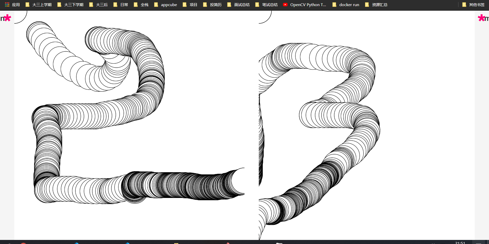
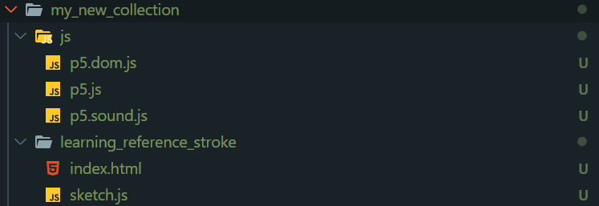

## by 20201010

#### 使用p5-manager搭建p5项目?

- 首先得nom install -g p5-manager

构建项目过程则是:

1. p5 new my_collection

2. p5 generate my_collection

3. p5 server/ p5 s

   ------

   p5 server --port   xxxx/ p5 s -p xxxx

- p5-manager还有分割窗口的功能

  

## by 2020/10/11

*我发现写算法题是多么的艰难,来学学p5不妨轻松一下*

运行p5 new命令后又出现一系列问题:

- 笔记本禁止运行脚本

```bash
p5 : 无法加载文件 C:\Users\nhy14\AppData\Roaming\npm\p5.ps1，因为在此系统上禁止运行脚本。有关详细信息，请参阅 https:/go.microsoft.com/fw 
link/?LinkID=135170 中的 about_Execution_Policies。
所在位置 行:1 字符: 1
+ ~~
    + CategoryInfo          : SecurityError: (:) []，PSSecurityException
    + FullyQualifiedErrorId : UnauthorizedAccess
```

解决办法:

```bash
set-ExecutionPolicy RemoteSigned
```

#### [p5js reference](https://p5js.org/reference/)

**alpha()**:

<!--Extracts the alpha value from a color or pixel array.-->

#### [构建process的类似项目](https://www.jianshu.com/p/0907f7b64e53)


```js
let particles;
const n = 120;

function setup() {
  createCanvas(900, 900);
  // pixelDensity(2);
  colorMode(HSB, 360, 100, 100, 100);
  rectMode(CENTER);
  newParticles();
}

function draw() {
  for (let i in particles) {
    let p = particles[i];
    p.run();
    if (p.isDead()) {
      particles.splice(i, 1);
    }
  }
}

function forms() {
  for (let j = 0; j < n; j++) {
    let x = random(width), y = random(height);
    let s = random(20, 100);
    let hs = s / 2;
    let c = getCol();
    noStroke();
    fill(c);
    if (random(1) > 0.5) {
      for (let i = -s / 2; i < s / 2; i++) {
        particles.push(new Particle(x + i, y - hs, c));
        particles.push(new Particle(x + i, y + hs, c));
        particles.push(new Particle(x - hs, y + i, c));
        particles.push(new Particle(x + hs, y + i, c));
      }
      square(x, y, s);
    } else {
      for (let a = 0; a < TAU; a += TAU / 360) {
        particles.push(new Particle(x + hs * cos(a), y + hs * sin(a), c));
      }
      circle(x, y, s);
    }
  }
}

function newParticles() {
  // particles = new ArrayList<Particle>();
  particles = new Array();
  background("#FCFCF0");
  forms();
  noiseSeed(parseInt(random(100000)));
}

// function mousePressed() {
//   newParticles();
// }

function keyPressed() {
  // 还没生效
  if (keyCode === 's') {
    saveFrame("123.png");
  }
}

function getCol() {
  let colors = ["#e4572e", "#29335c", "#f3a712", "#a8c686", "#669bbc", "#efc2f0"];
  //let colors = ["#880D1E", "#DD2D4A", "#F26A8D", "#F49CBB", "#CBEEF3"];
  let idx = parseInt(random(colors.length));
  // console.log(idx + colors[idx]);
  return colors[idx];
}

class Particle {
  constructor(x, y, col) {
    this.pos = createVector(x, y);
    this.step = 1;
    this.angle = random(10);
    this.lifeSpan = 100;
    this.noiseScale = 800;
    this.noiseStrength = 90;
    this.col = col;
  }

  show() {
    noStroke();
    // fill(this.col, this.lifeSpan);
    fill(this.col);
    circle(this.pos.x, this.pos.y, 0.5);
  }

  move() {
    this.angle = noise(this.pos.x / this.noiseScale, this.pos.y / this.noiseScale) * this.noiseStrength;
    this.pos.x += cos(this.angle) * this.step;
    this.pos.y += sin(this.angle) * this.step;
    this.lifeSpan -= 0.1;
  }

  isDead() {
    return (this.lifeSpan < 0.0)
  }

  run() {
    this.show();
    this.move();
  }
}
```

放在p5_my_collection发生错误:

```
circle() is not defined
```

网上一搜,发现是版本的问题,所以要p5 update,然后.....

```error
Unhandled promise rejections are deprecated. In the future, promise rejections that are not handled will terminate the Node.js process with a non-zero exit code.
```

再查,就说是什么js异步的一些东西,可能是p5-manage的源码出了啥问题,之后issue,所以我转变方式,直接npm install p5,然后复制粘贴,success!


## by 2020/10/13

### **我发现把所有的学习过程写的代码全都写在my_collection里面,会使p5_server变得不好用,一次加载过程太长了**

所以我就直接换成之前的embedding目录结构了



之后直接添加子目录就好了

### by 2020/11/18

p5js暂时告一段落，设计能力和创新思维等有时间了再去挖掘了


